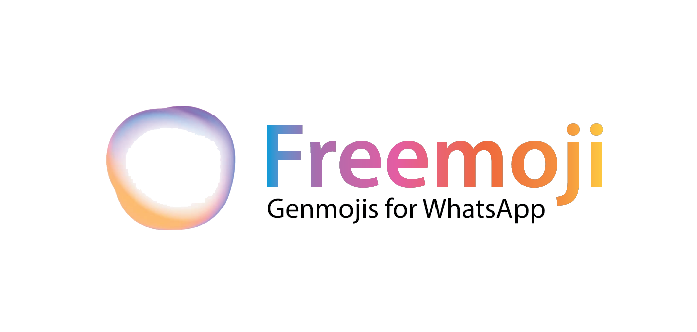

# Freemoji



Freemoji brings Apple’s Genmoji concept to life, but with WhatsApp-style emojis and powered by open-source models! Best of all, Freemoji works seamlessly across all devices—not just Apple.

Take a look at what Freemoji can do:
|  | |  |  |  |  |  |
| --------------------------------------------------------- | ---------------------------------------------------- | ------------------------------------------------------- | -------------------------------------------------------- | ----------------------------------------------------- | ---------------------------------------------------- |---------------------------------------------------- |

Freemoji is a collection of LoRA files (available on [HuggingFace](https://huggingface.co/henil08/Whatsapp-Freemoji)) specially fine-tuned on thousands of WhatsApp emojis. These files enable an image generation model to create custom emojis effortlessly. You can use Freemoji anywhere a LoRA can be added to an image generation model.

Freemoji also includes a powerful feature called Prompt Assist, designed to help you craft the perfect prompt for creating any emoji you envision. The best part? You can easily add your creations as WhatsApp Stickers and even use them as real emojis on iOS 18+—all without relying on Apple Intelligence.

Explore the Tutorial for a step-by-step guide.


## Table of Contents
- [Tutorial](#tutorial)
    - [Prerequisites](#prerequisites)
    - [Downloading the Model](#downloading-the-model)
    - [Running Freemoji](#running-freemoji)
    - [Running Freemoji Genmoji with `mflux`](#running-freemoji-with-mflux)
    - [Running Freemoji with Prompt Assist](#running-freemoji-with-prompt-assist)
    - [Ollama Prompt Assist](#ollama-prompt-assist)
- [Add Sticker](#add-sticker)


## Tutorial

> This tutorial is tailored specifically for **macOS**. However, Freemoji is fully compatible with other operating systems. You’ll simply need an alternative tool to run Flux.1 Dev with a LoRA.

This guide will lead you through all the steps necessary to run Freemoji, and also use the Prompt Assist metaprompt. First, let's get started by simply running the model.

### Prerequisites

This project **works best with Python 3.11**. If you have a Python Version Manager, simply install Python 3.11, and also ensure to create your `venv` with `python3.11`. After that, we need to set up Hugging Face and Ollama.

**Cloning the Repo and Setup up Python Environment**
1. First, clone into this repo:
    
    ```bash
    git clone https://github.com/Henil-08/freemoji.git
    ```

2. Next, we need to install the dependencies. It is recommended you first create a `venv`.

    ```bash
    conda create -p venv python=3.11 -y

    # Install poetry package manager
    pip install -U pip poetry
    poetry config virtualenvs.create false

    # Install the dependencies
    poetry install
    ```

**Setting Up HuggingFace and Ollama**:

1. Run `huggingface-cli login` and use your token to login
2. Go to [Flux.1 Dev Hugging Face Page](https://huggingface.co/black-forest-labs/FLUX.1-dev). Read and agree to the terms at the top to use the Gated model.
3. Go to [Ollama](https://ollama.com/) and install Ollama in your system.
4. Then, Run `ollama run llama3.1` to download llama3.1 8B model to your system.

You're all done!

### Downloading the Model

Whatsapp-Freemoji LoRA is available on HuggingFace at [henil08/Whatsapp-Freemoji](https://huggingface.co/henil08/Whatsapp-Freemoji). However, there's a script included in this repository that makes downloading these LoRAs simple.

All you have to do is run the `download.py` script available in the root directory:

```bash
poetry run python download.py
```

The LoRA has a brief description, and the model it works with. Give it a few seconds, and check that `fine-tune/models/whatsapp-freemoji.safetensors` is installed. It should be a 209.3MB file. You're all good to go!

### Running Freemoji

The Freemoji application provides a user-friendly way to generate emojis using a Streamlit interface. This eliminates the need to run complex commands manually, making it accessible for everyone, even without prior technical expertise.

Launch the Streamlit app by running the following command:
```bash
poetry run streamlit run app.py
```

This will open a local web interface in your default browser where you can interact with the Freemoji app.

The Streamlit app provides the following features:

1. Input Your Prompt
	•	Enter a description of the emoji you want to generate in the text input field.
	•	For example, you can write 'fireplace' or 'a squirrel holding an iPhone'.

2. Use Prompt Assistant
	•	You can toggle the Use Prompt Assistant checkbox to enable or disable the prompt optimization feature.
	•	If enabled, the assistant will refine your input prompt for better results.

3. Customize Image Dimensions
	•	Use the sliders and number input fields to set the desired width and height of the emoji in pixels.

4. Upscale Factor
	•	Adjust the upscale factor (1–10) to generate higher-resolution images. (use 5x minimum for using it as iOS/Whatsapp sticker)

> **Note**: Before it saves, it'll also do the Postprocessing step of resizing it to 5x the size with anti-aliasing (160x160 → 800x800). Learn more in [Add Sticker](#add-sticker)

5. Generate Image
	•	Click the “Generate Image” button to start the process.
	•	A spinner will appear, indicating that the app is processing your request.

6. View and Save Results
	•	Once the emoji is generated, it will be displayed on the page.
	•	The app automatically saves the emoji to the specified output path. You can customize this path in the text input field.

> **Note**: Generating an image takes approximately **80 seconds** on an M4 Pro MacBook Pro with a 20-core GPU. The duration may vary based on your system’s specifications.

Play around with the prompt, and see what you can make. Head on to [Add Sticker](#add-sticker) to start using your creation as an actual emoji on your iPhone, or learn a bit more below about how to chain Prompt Assist and `mflux` together.

### Running Freemoji with `mflux`

The image model we'll be using in this guide is Flux.1 Dev. Run the following command and you'll be able to create your emoji (If you're struggling with a good result, check out [Prompt Assist](#running-freemoji-with-prompt-assist))

```bash
mflux-generate \
    --model dev \
    --prompt "your prompt" \
    --steps 20 \
    --seed 2 \
    --quantize 8 \
    --guidance 5.0 \
    --width 160 \
    --height 160 \
    --lora-paths "./fine-tune/models/whatsapp-freemoji.safetensors"
```

### Running Freemoji with Prompt Assist

It's pretty difficult to get a good prompt to make a Whatsapp-like emoji. Thus, we'll use a metaprompt... a prompt for an LLM, to make a prompt for Open Genmoji. Here's an example:

| Input        | Output                                                                                                                                      |
| ------------ | ------------------------------------------------------------------------------------------------------------------------------------------- |
| `a Fireplace` | `emoji of cozy brick fireplace with burning orange-yellow flames and dark gray ash. detailed texture. warm golden light from fire. 3D lighting. no cast shadows.` |

The output prompt is now much better, and the generated emoji will be of much better quality.

You can run the metaprompt in any place an LLM is available, including ChatGPT and Llama! Each LoRA has its own metaprompt. However in our case, we'll simply be using `prompt/freemoji.md`, for the `whatsapp-freemoji` LoRA. Now, give the prompt to the LLM, and after it, include your user prompt. Something like this:

```
{METAPROMPT HERE}

USER PROMPT: {your input}
```

Then, take the LLM output and feed that to `mflux`. Observe how the output is much better!

Now that you have a image output, head on to [Add Sticker](#add-sticker) to start using your creation as an actual emoji on your iPhone, or learn a bit more below about how to chain Prompt Assist and `mflux` together.

### Ollama Prompt Assist

It's a bit tedious to feed your own prompt to an LLM, then feed the LLM output to `mflux`. So I made a quick Python workflow to chain these things together. 

It's a bit of a specific/personal setup, but I decided to push it in case anyone wants to use it too. 

First, you'll need to install [Ollama](https://ollama.com/) and download your favorite model. (I have downlaoded llama3.1 8B for this project)

Now, given that Ollama is correctly set up, you should be able to directly run:

```bash
poetry run python promptAssist.py "[your prompt]"
```

Now, let's take a look at [Add Sticker](#add-sticker) to start using your creation as an actual sticker in Whatsapp and iOS.


## Add Sticker

Once you've generated an image using the Streamlit web app, you can easily transfer it to your phone and use it as a Sticker (iOS 17+) or Emoji (iOS 18+). Follow these simple steps:

### For iOS Stickers or Emojis:
1. Transfer the image to your phone and open it in the **Photos** app.
2. Long press on the emoji in the picture (**hold your finger still**) for about 2 seconds.
3. Release your finger and tap the **Add Sticker** button.

- **iOS 17+**: You can apply the sticker by dragging it onto a message.
- **iOS 18+**: The sticker will be available in your emoji menu, where you can tap to use it inline like a regular emoji.

To delete a Sticker:
- Long press on the sticker in your Sticker gallery (**hold your finger still**) for about 2 seconds.
- Release and select **Delete**.

### For WhatsApp Stickers:

Using the generated image as a WhatsApp sticker is simple and quick. Here's how:

1. **Save the Image**: Transfer the image to your phone and save it to your gallery.  
2. **Create the Sticker**: 
   - Open WhatsApp and navigate to the stickers section in a chat.  
   - Tap the **Create** icon and select the image from your gallery.  
3. **Save or Send**: Once the image is selected, you can customize it if needed, then save it or send it directly in the chat.  

That’s it! Your custom sticker is now ready to use. You can also access it later from the stickers section.


## Fine-Tuning

Check out `fine-tune/README.md` for more information about finetuning your own LoRA.

## Credit

A Big Shout out to [EvanZhouDev](https://github.com/EvanZhouDev) for his [Open-Genmoji](https://github.com/EvanZhouDev/open-genmoji) project in which he replicated Apple's Genmoji with Apple Emoji